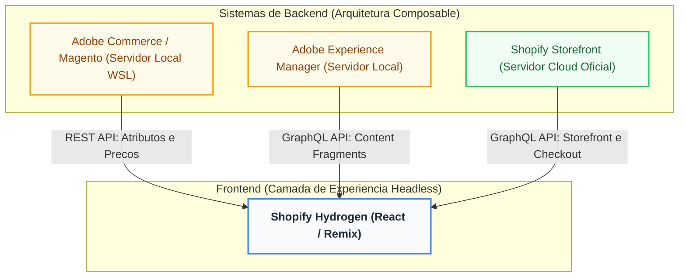

# Loja- E-commerce Headless

Este é o projeto final do **Bootcamp**, focado na construção de uma arquitetura Headless e Composable. O sistema integra múltiplos microsserviços de backend a uma interface de alta performance desenvolvida em React utilizando o Shopify Hydrogen.

## 🏗️ Arquitetura do Sistema
O ecossistema foi projetado para operar de forma integrada, dividindo responsabilidades entre plataformas líderes de mercado:
- **Adobe Commerce (Magento):** Atua como o backend central para gestão de catálogo e regras de negócio.
- **Adobe Experience Manager (AEM):** CMS Headless responsável por gerenciar experiências e entregar Content Fragments via GraphQL.
- **Shopify:** Utilizado exclusivamente como motor de checkout e processamento de transações.
- **Shopify Hydrogen:** Frontend integrador que consome as APIs de todas as plataformas para renderizar a interface final.

## 🔄 Fluxos de Integração (End-to-End)

Conforme os requisitos arquiteturais do projeto, o sistema contempla 4 fluxos de dados principais:
1. **Commerce → AEM:** O Commerce expõe o catálogo via API REST. O AEM consome esses dados, permitindo a criação de Content Fragments enriquecidos associados ao SKU original.
2. **AEM → Commerce:** Dados de experiência e conteúdo ricos gerenciados no AEM são sincronizados de volta e disponibilizados para o motor do Commerce.
3. **AEM → Hydrogen:** A interface frontend busca os Content Fragments (como as informações da "Garrafa Térmica Dev") diretamente do AEM utilizando chamadas GraphQL.
4. **Shopify → Hydrogen:** O Hydrogen consome os dados de carrinho e processa o checkout de forma segura via Shopify Storefront API.

## 📊 Dashboard de Saúde e Integração
Disponível na rota `/dashboard`, este painel realiza chamadas simultâneas (`Promise.allSettled`) para auditar a saúde da arquitetura. Ele monitora em tempo real:
- O status da conexão (Online/Offline) de cada microsserviço.
- A **quantidade de produtos** sincronizados e indexados em cada plataforma individualmente.

## 🚀 Guia de Teste (Demonstração da Integração)
Para validar o ecossistema funcionando em conjunto, execute o fluxo a seguir:
1. **Criação Backend:** Cadastre um novo produto no Adobe Commerce Admin (ex: "Garrafa Térmica Dev").
2. **Enriquecimento:** Acesse o AEM Author, crie um Content Fragment associado a este produto e insira os detalhes de marketing (como os atributos de *Tech Stack*).
3. **Consumo:** Navegue até a página inicial do Hydrogen. O produto será exibido consumindo os dados diretamente da nuvem do AEM em tempo real.
4. **Validação:** Acesse a rota `/dashboard` e verifique a volumetria de produtos e a estabilidade da rede entre o Commerce, AEM e Shopify.
